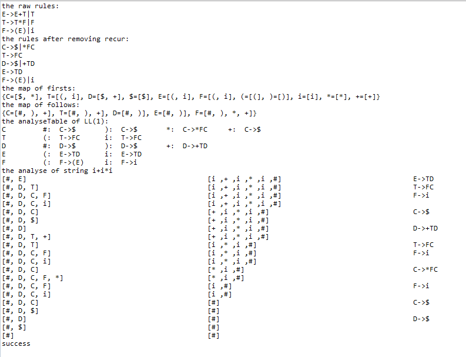

## the lexical analysis
[lexical source](https://github.com/lujiamin/course/blob/master/compile/Analyse.java)
## the syntax analysis
[syntax analysis](https://github.com/lujiamin/course/blob/master/compile/GrammarAnalyse.java)
- 简单测试结果如下

